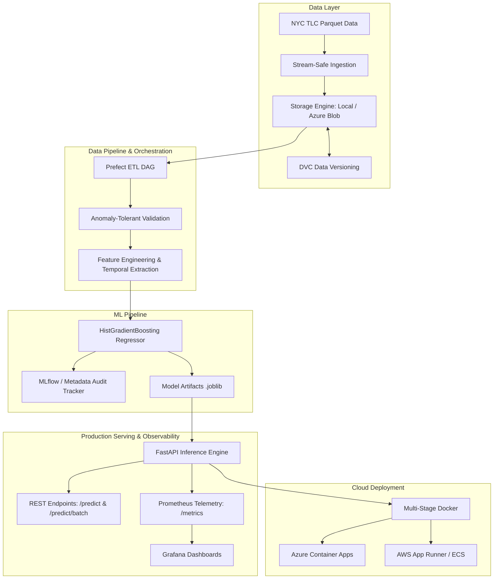

# FleetSense Platform 🚖⚡

> **Production-Grade Machine Learning Platform for NYC Taxi Trip Duration Forecasting & Real-Time Demand Intelligence.**

[](https://github.com/sarayusreeyp/FleetSense-Platform/actions)
[](https://www.python.org/downloads/)
[](https://fastapi.tiangolo.com)
[](https://prefect.io)
[](https://dvc.org)
[](https://prometheus.io)
[](LICENSE)

---

## 📌 Architecture Overview

FleetSense is engineered from the ground up for high reliability, memory efficiency, and cloud scalability across multi-million row TLC datasets:



---

## ✨ Key Platform Features

1. **Memory-Safe Ingestion & Storage Abstraction**:
   - Zero-RAM overhead streaming file downloads (`shutil.copyfileobj`).
   - Unified Storage interface supporting atomic local operations with path traversal sanitization and native **Azure Blob Storage** integration.
2. **Anomaly-Tolerant Validation Engine**:
   - TLC real-world datasets often have negative distances or passenger counts. FleetSense enforces configurable quality thresholds (`max_allowed_loss_pct=35.0`), logging dropped anomalies rather than failing pipelines.
3. **Data Version Control (DVC)**:
   - Full versioning of raw and processed Parquet data with cloud remotes (`azure://` or `s3://`).
4. **Fast & Scalable ML Engine**:
   - High-throughput `HistGradientBoostingRegressor` with native categorical feature support for taxi pickup/dropoff zones.
   - Dual-mode experiment tracking: cloud MLflow tracking with automatic graceful degradation to local audit files in `artifacts/metadata/`.
5. **Production FastAPI Service**:
   - Pydantic v2 validated single (`/predict`) and vectorized batch (`/predict/batch`) endpoints.
   - Dynamic feature alignment against loaded model signatures.
6. **Built-in Prometheus Observability**:
   - Request latency histograms, request counters, predicted duration distributions, and incoming trip distance histograms for **data drift detection**.
7. **Production Containerization & CI/CD**:
   - Multi-stage non-root `Dockerfile`, automated `docker-compose` stack (API, Prometheus, Grafana), GitHub Actions CI/CD matrix, and Azure/AWS deployment scripts.

---

## 📂 Project Structure

```text
FleetSense-Platform/
├── .github/workflows/         # CI/CD pipelines (Test matrix, Docker publish)
│   ├── ci.yml
│   └── cd.yml
├── .dvc/                      # Data Version Control configuration
├── configs/                   # Type-safe YAML configurations (OmegaConf/Hydra)
│   ├── config.yaml            # App, storage, data & ingestion settings
│   └── model.yaml             # ML model hyperparameters
├── deploy/                    # Cloud deployment templates & scripts
│   ├── azure/                 # Azure Container Apps & Bicep IaC
│   ├── aws/                   # AWS App Runner deployment scripts
│   └── monitoring/            # Prometheus scrape configuration
├── src/fleetsense/            # Core package source code
│   ├── api/                   # FastAPI routes, Pydantic schemas, and inference
│   ├── core/                  # Constants, logging, config loader, exceptions
│   ├── etl/                   # Dataset streaming, validation & processing
│   ├── ml/                    # Training, HistGradientBoosting, experiment tracking
│   ├── monitoring/            # Prometheus collectors & telemetry helpers
│   ├── storage/               # Local and Azure Blob storage backends
│   └── workflows/             # Prefect DAGs for ETL and Training
├── tests/                     # 89 unit and integration tests (100% passing)
├── docker-compose.yml         # Local orchestration (API + Prometheus + Grafana)
├── Dockerfile                 # Multi-stage production container
├── pyproject.toml             # Modern PEP 621 packaging metadata
└── requirements.txt           # Production pinned dependencies
```

---

## 🚀 Quickstart & Setup

### 1. Clone & Set Up Environment

```bash
git clone https://github.com/sarayusreeyp/FleetSense-Platform.git
cd FleetSense-Platform

# Create and activate virtual environment
python -m venv .venv
source .venv/bin/activate  # On Windows: .venv\Scripts\activate

# Install dependencies and editable package
pip install -r requirements.txt
pip install -e .
```

### 2. Configure Environment Variables

```bash
# For local development:
cp .env.development .env

# Or for production:
# cp .env.production .env
```

### 3. Data Version Control (DVC)

```bash
# Pull versioned datasets (if remote configured)
dvc pull

# Track local datasets with DVC
dvc add data/raw/yellow_tripdata_2026-06.parquet
git add data/raw/yellow_tripdata_2026-06.parquet.dvc
dvc push
```

---

## 🔄 Orchestration Workflows (Prefect)

### Run ETL Pipeline
Ingests raw TLC Parquet data, executes anomaly validation, and produces engineered features:
```bash
python -m fleetsense.workflows.etl
```

### Run Model Training Pipeline
Trains `HistGradientBoostingRegressor`, evaluates RMSE/MAE/R², logs metrics, and exports model artifact to `artifacts/models/latest_model.joblib`:
```bash
python -m fleetsense.workflows.train
```

---

## ⚡ Production API & Observability

### Start FastAPI Server
```bash
uvicorn fleetsense.api.main:app --host 0.0.0.0 --port 8000 --reload
```

Interactive Swagger documentation is available at: **`http://localhost:8000/docs`**

#### Predict Trip Duration Example:
```bash
curl -X POST "http://localhost:8000/predict" \
     -H "Content-Type: application/json" \
     -d '{
       "VendorID": 1,
       "pickup_datetime": "2026-10-05T14:30:00",
       "passenger_count": 2,
       "trip_distance": 3.8,
       "PULocationID": 161,
       "DOLocationID": 236
     }'
```

Response:
```json
{
  "predicted_duration_minutes": 18.42,
  "estimated_dropoff_datetime": "2026-10-05T14:48:25",
  "model_algorithm": "HistGradientBoostingRegressor",
  "model_version": "v1"
}
```

#### Telemetry & Metrics:
- Scrape Prometheus metrics: **`http://localhost:8000/metrics`**

---

## 🐳 Docker & Docker Compose

Launch the entire stack (FastAPI inference engine, Prometheus metrics collection, Grafana visualization) in one command:

```bash
docker-compose up --build -d
```

- **FleetSense API**: http://localhost:8000
- **Prometheus Dashboard**: http://localhost:9090
- **Grafana Dashboard**: http://localhost:3000 *(login: `admin` / `admin`)*

---

## ☁️ Cloud Deployment

Comprehensive scripts and Infrastructure-as-Code templates are located in [`deploy/`](deploy/README.md):

### Deploy to Azure Container Apps:
```bash
chmod +x deploy/azure/deploy.sh
./deploy/azure/deploy.sh
```

### Deploy to AWS App Runner:
```bash
chmod +x deploy/aws/deploy.sh
./deploy/aws/deploy.sh
```

---

## 🧪 Testing

The test suite covers configuration, logging, exceptions, storage engines, streaming downloaders, anomaly validation, Prefect DAGs, ML training, FastAPI endpoints, and Prometheus metrics.

```bash
pytest -v
```

```text
============================== 89 passed in 17.81s ==============================
```

---

## 📄 License

This project is licensed under the MIT License - see the [LICENSE](LICENSE) file for details.